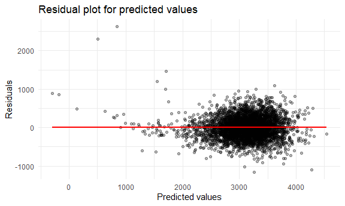
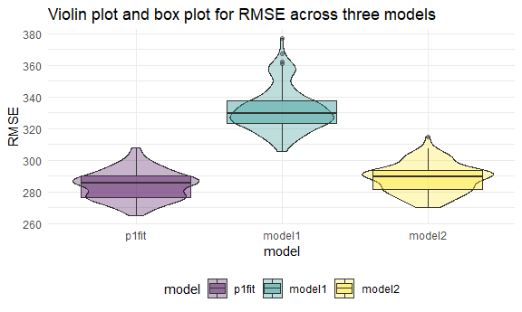
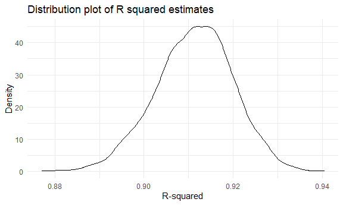
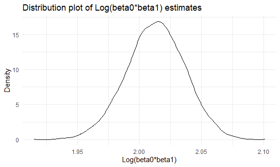

p8105\_hw6\_nz2333
================
nz2333
12/4/2021

``` r
library(tidyverse)
```

    ## -- Attaching packages --------------------------------------- tidyverse 1.3.1 --

    ## v ggplot2 3.3.5     v purrr   0.3.4
    ## v tibble  3.1.4     v dplyr   1.0.7
    ## v tidyr   1.1.3     v stringr 1.4.0
    ## v readr   2.0.1     v forcats 0.5.1

    ## -- Conflicts ------------------------------------------ tidyverse_conflicts() --
    ## x dplyr::filter() masks stats::filter()
    ## x dplyr::lag()    masks stats::lag()

``` r
library(modelr)
library(mgcv)
```

    ## Loading required package: nlme

    ## 
    ## Attaching package: 'nlme'

    ## The following object is masked from 'package:dplyr':
    ## 
    ##     collapse

    ## This is mgcv 1.8-36. For overview type 'help("mgcv-package")'.

``` r
set.seed(1)

knitr::opts_chunk$set(
  fig.width = 6,
  fig.asp = .6,
  out.width = "90%"
)

theme_set(theme_minimal() + theme(legend.position = "bottom"))

options(
  ggplot2.continuous.colour = "viridis",
  ggplot2.continuous.fill = "viridis"
)

scale_colour_discrete = scale_colour_viridis_d
scale_fill_discrete = scale_fill_viridis_d
```

## Problem 1

*Clean data*

``` r
problem1_df = read_csv("./birthweight.csv") %>%
  janitor::clean_names() %>%
  mutate(
    babysex = as.factor(babysex),
    frace = as.factor(frace),
    malform = as.factor(malform),
    mrace = as.factor(mrace),
    
    babysex = recode(babysex, "1" = "Male", "2" = "Female"), 
    frace = recode(frace, "1" = "White", "2" = "Black", "3" = "Asian", "4" = "Puerto Rican", "8" = "Other", "9" = "Unknown"),
    malform = recode(malform, "0" = "absent", "1" = "present"),
    mrace = recode(mrace, "1" = "White", "2" = "Black", "3" = "Asian", "4" = "Puerto Rican", "8" = "Other", "9" = "Unknown")
  )
```

    ## Rows: 4342 Columns: 20

    ## -- Column specification --------------------------------------------------------
    ## Delimiter: ","
    ## dbl (20): babysex, bhead, blength, bwt, delwt, fincome, frace, gaweeks, malf...

    ## 
    ## i Use `spec()` to retrieve the full column specification for this data.
    ## i Specify the column types or set `show_col_types = FALSE` to quiet this message.

``` r
problem1_df
```

    ## # A tibble: 4,342 x 20
    ##    babysex bhead blength   bwt delwt fincome frace gaweeks malform menarche
    ##    <fct>   <dbl>   <dbl> <dbl> <dbl>   <dbl> <fct>   <dbl> <fct>      <dbl>
    ##  1 Female     34      51  3629   177      35 White    39.9 absent        13
    ##  2 Male       34      48  3062   156      65 Black    25.9 absent        14
    ##  3 Female     36      50  3345   148      85 White    39.9 absent        12
    ##  4 Male       34      52  3062   157      55 White    40   absent        14
    ##  5 Female     34      52  3374   156       5 White    41.6 absent        13
    ##  6 Male       33      52  3374   129      55 White    40.7 absent        12
    ##  7 Female     33      46  2523   126      96 Black    40.3 absent        14
    ##  8 Female     33      49  2778   140       5 White    37.4 absent        12
    ##  9 Male       36      52  3515   146      85 White    40.3 absent        11
    ## 10 Male       33      50  3459   169      75 Black    40.7 absent        12
    ## # ... with 4,332 more rows, and 10 more variables: mheight <dbl>, momage <dbl>,
    ## #   mrace <fct>, parity <dbl>, pnumlbw <dbl>, pnumsga <dbl>, ppbmi <dbl>,
    ## #   ppwt <dbl>, smoken <dbl>, wtgain <dbl>

*Check for missing values*

``` r
map(problem1_df, ~sum(is.na(.)))
```

    ## $babysex
    ## [1] 0
    ## 
    ## $bhead
    ## [1] 0
    ## 
    ## $blength
    ## [1] 0
    ## 
    ## $bwt
    ## [1] 0
    ## 
    ## $delwt
    ## [1] 0
    ## 
    ## $fincome
    ## [1] 0
    ## 
    ## $frace
    ## [1] 0
    ## 
    ## $gaweeks
    ## [1] 0
    ## 
    ## $malform
    ## [1] 0
    ## 
    ## $menarche
    ## [1] 0
    ## 
    ## $mheight
    ## [1] 0
    ## 
    ## $momage
    ## [1] 0
    ## 
    ## $mrace
    ## [1] 0
    ## 
    ## $parity
    ## [1] 0
    ## 
    ## $pnumlbw
    ## [1] 0
    ## 
    ## $pnumsga
    ## [1] 0
    ## 
    ## $ppbmi
    ## [1] 0
    ## 
    ## $ppwt
    ## [1] 0
    ## 
    ## $smoken
    ## [1] 0
    ## 
    ## $wtgain
    ## [1] 0

No missing data is found for all variables.

*Model proposal*

Since we are trying to understand the effects of several variables on a
child’s birthweight, I propose to associate birthweight with gender,
baby’s length and head circumstances at birth, mother’s weight gain
during pregnancy and mother’s height.

``` r
p1_fit = lm(bwt ~ babysex + bhead + blength + wtgain + mheight, data = problem1_df)
```

*Plot of residuals and predicted values*

``` r
problem1_df %>% 
  modelr::add_residuals(p1_fit) %>%
  modelr::add_predictions(p1_fit) %>%
  ggplot(aes(x = pred, y = resid)) +
  geom_point(alpha = 0.3) +
  geom_smooth(color = "red", method = "lm", se = FALSE) +
  labs(
    title = "Residual plot for predicted values", 
    x = "Predicted values", 
    y = "Residuals"
  )
```

    ## `geom_smooth()` using formula 'y ~ x'



Residuals are evenly distributed around 0, so the asusmption of constant
variance of residuals hold. However, there are some extreme values on
the left side, suggesting outliers.

*Comparison with two other models*

``` r
model1 = lm(bwt ~ blength + gaweeks, data = problem1_df)
model2 = lm(bwt ~ bhead + blength + babysex + bhead*blength + blength*babysex + bhead*babysex + bhead*blength*babysex, data = problem1_df)

broom::tidy(model1)
```

    ## # A tibble: 3 x 5
    ##   term        estimate std.error statistic  p.value
    ##   <chr>          <dbl>     <dbl>     <dbl>    <dbl>
    ## 1 (Intercept)  -4348.      98.0      -44.4 0       
    ## 2 blength        129.       1.99      64.6 0       
    ## 3 gaweeks         27.0      1.72      15.7 2.36e-54

``` r
broom::tidy(model2)
```

    ## # A tibble: 8 x 5
    ##   term                         estimate std.error statistic      p.value
    ##   <chr>                           <dbl>     <dbl>     <dbl>        <dbl>
    ## 1 (Intercept)                 -7177.     1265.       -5.67  0.0000000149
    ## 2 bhead                         182.       38.1       4.78  0.00000184  
    ## 3 blength                       102.       26.2       3.90  0.0000992   
    ## 4 babysexFemale                6375.     1678.        3.80  0.000147    
    ## 5 bhead:blength                  -0.554     0.780    -0.710 0.478       
    ## 6 blength:babysexFemale        -124.       35.1      -3.52  0.000429    
    ## 7 bhead:babysexFemale          -198.       51.1      -3.88  0.000105    
    ## 8 bhead:blength:babysexFemale     3.88      1.06      3.67  0.000245

*Cross validation*

``` r
cv_df = crossv_mc(problem1_df, 100)

cv_df =
  cv_df %>% 
  mutate(
    train = map(train, as_tibble),
    test = map(test, as_tibble)
  )

cv_df = cv_df %>%
  mutate(
    p1_fit = map(train, ~lm(bwt ~ babysex + bhead + blength + wtgain + mheight, data = .x)), 
    model1 = map(train, ~lm(bwt ~ blength + gaweeks, data = .x)), 
    model2 = map(train, ~lm(bwt ~ bhead + blength + babysex + bhead*blength + blength*babysex + bhead*babysex + bhead*blength*babysex, data = .x))
  ) %>%
  mutate(
    rmse_p1fit = map2_dbl(p1_fit, test, ~rmse(model = .x, data = .y)),
    rmse_model1 = map2_dbl(model1, test, ~rmse(model = .x, data = .y)),
    rmse_model2 = map2_dbl(model2, test, ~rmse(model = .x, data = .y)))
```

*Plot of RMSEs*

``` r
cv_df %>% 
  select(starts_with("rmse")) %>% 
  pivot_longer(
    everything(),
    names_to = "model", 
    values_to = "rmse",
    names_prefix = "rmse_") %>% 
  mutate(model = fct_inorder(model)) %>% 
  ggplot(aes(x = model, y = rmse, fill = model)) + 
  geom_violin(alpha = 0.3) +
  geom_boxplot(alpha = 0.4) +
  labs(
    title = "Violin plot and box plot for RMSE across three models", 
    x = "model", 
    y = "RMSE"
  )
```



The plot shows that my proposed model p1fit has the lowest RMSE, which
means that this model is the best model fitted among the three through
comparison.

## Problem 2

``` r
weather_df = 
  rnoaa::meteo_pull_monitors(
    c("USW00094728"),
    var = c("PRCP", "TMIN", "TMAX"), 
    date_min = "2017-01-01",
    date_max = "2017-12-31") %>%
  mutate(
    name = recode(id, USW00094728 = "CentralPark_NY"),
    tmin = tmin / 10,
    tmax = tmax / 10) %>%
  select(name, id, everything())
```

    ## Registered S3 method overwritten by 'hoardr':
    ##   method           from
    ##   print.cache_info httr

    ## using cached file: C:\Users\Meiei\AppData\Local/Cache/R/noaa_ghcnd/USW00094728.dly

    ## date created (size, mb): 2021-10-20 03:39:25 (7.621)

    ## file min/max dates: 1869-01-01 / 2021-10-31

*R squared*

``` r
p2_r2 = weather_df %>% 
  modelr::bootstrap(n = 5000) %>% 
  mutate(
    models = map(strap, ~lm(tmax ~ tmin, data = .x) ),
    results = map(models, broom::glance)) %>% 
  select(-strap, -models) %>% 
  unnest(results)

p2_r2 %>%
  summarize(
    ci_lower = quantile(r.squared, 0.025), 
    ci_upper = quantile(r.squared, 0.975))
```

    ## # A tibble: 1 x 2
    ##   ci_lower ci_upper
    ##      <dbl>    <dbl>
    ## 1    0.894    0.927

``` r
p2_r2 %>%
ggplot(aes(x = r.squared)) +
  geom_density() +
  labs(
    title = "Distribution plot of R squared estimates", 
    x = "R-squared", 
    y = "Density"
  )
```



The 95% Confidence interval for R squared is (0.894, 0.927). The
distribution over the R squared estimates approximates a normal
distribution with a bell shaped curve. The mean is 0.911 and standard
deviation is 0.009.

*Log betas*

``` r
p2_log = weather_df %>% 
  modelr::bootstrap(n = 5000) %>% 
  mutate(
    models = map(strap, ~lm(tmax ~ tmin, data = .x) ),
    results = map(models, broom::tidy)) %>% 
  select(-strap, -models) %>% 
  unnest(results)

log = p2_log %>%
  select(.id, term, estimate) %>%
  pivot_wider(
    names_from = "term",
    values_from = "estimate"
  ) %>%
  mutate(
    log = log(`(Intercept)` *tmin)
  )

log %>%
  summarize(
    ci_lower = quantile(log, 0.025), 
    ci_upper = quantile(log, 0.975))
```

    ## # A tibble: 1 x 2
    ##   ci_lower ci_upper
    ##      <dbl>    <dbl>
    ## 1     1.97     2.06

``` r
log %>%
ggplot(aes(x = log)) +
  geom_density() +
  labs(
    title = "Distribution plot of Log(beta0*beta1) estimates", 
    x = "Log(beta0*beta1)", 
    y = "Density"
  )
```



The 95% Confidence interval for Log(beta0*beta1) is (1.97, 2.06). The
distribution over the Log(beta0*beta1) estimates approximates a normal
distribution with a bell shaped curve. The mean is 2.013 and standard
deviation is 0.024
